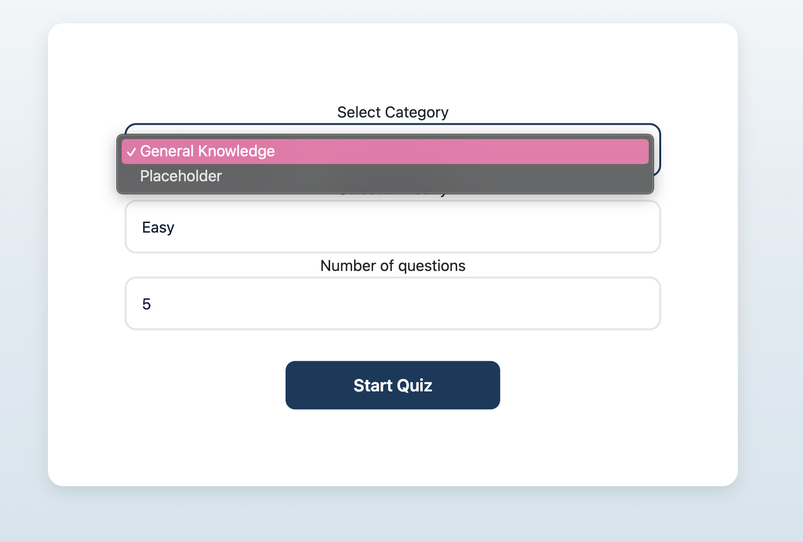
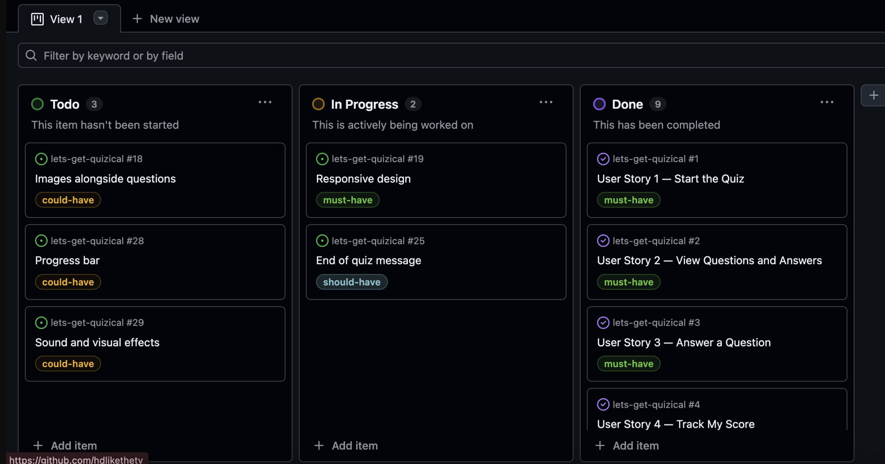
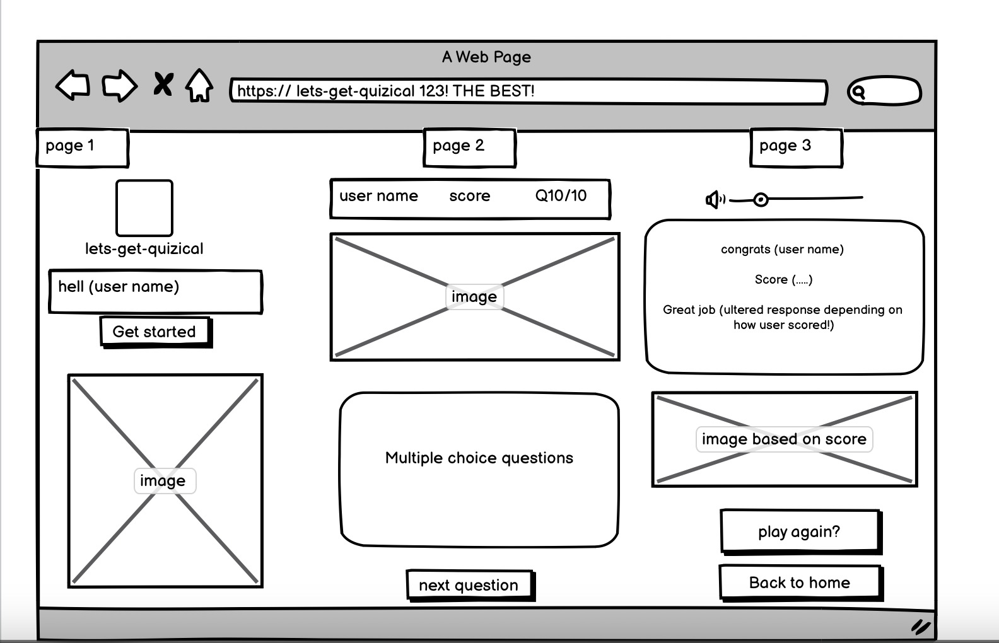
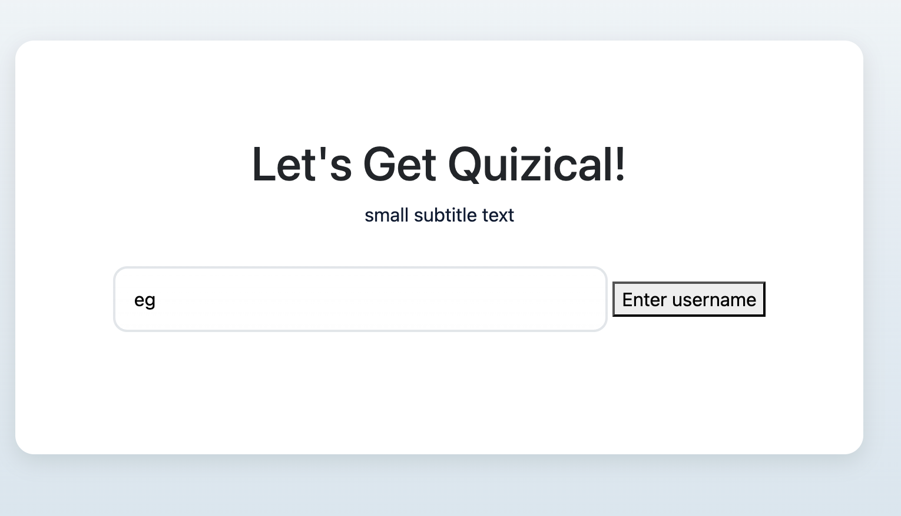

# Let's Get Quizical 
hi 

## Table of Contents

- [Index](#index)
- [Introduction](index.html#introduction-screen)
- [Features and Responsive Design Screen](index.html#features-screen)
- [Planning Screen](index.html#planning-screen)
- [Technologies Used](#technologies-used)
- [Deployment](#deployment-screen)
- [Testing & Validation](#testing-screen)
- [Reflection on AI Usage](#reflection-screen)

## Introduction

Let's Get Quizical is a lightweight, interactive quiz web application built with HTML, CSS, and JavaScript.

This repository contains a small single-page quiz that lets user enter a name, answer multiple-choice questions one-by-one, and see a final score summary. The game is designed for all age groups, users can tailor their experience by adjusting the difficulty and subject matter, ensuring that each session feels fresh and engaging. This project was created collaboratively by Shiree, Harry, Declan, and Hau — also known as The Quizzy Rascals! 🎉

## Features and Responsive Design

- Allows player to insert name, must be over 3 letters or a pop-up box will appear preventing the player from going any futher.
- Presents questions one at a time with multiple-choice answers.
- Allows player to insert name, must be over 3 letters or a pop-up box will appear preventing the player from going any futher.
- Presents questions one at a time with multiple-choice answers.
- Shows progress (question number / total)
- Tracks answers in memory and shows final score.
- Tracks answers in memory and shows final score.
- Responsive layout for desktop and mobile responsive for any device
- Has a sound on click.
- Button changes green if correct answer is selected or red if incorrect.
- Drop down menu provided to show the category, level number of questions before starting the game.
- Has a sound on click.
- Button changes green if correct answer is selected or red if incorrect.
- Drop down menu provided to show the category, level number of questions before starting the game.

## ⚙️ Planning

Before starting the project, we discussed how we would plan and structure the development process. Hau, created a Notion planning page, based on what we collectively discussed which outlined the workflow, project goals, and the steps needed to build the quiz app. This gave the team a clear structure to follow and ensured we stayed focused and on track. It also provided us with a visual of what we wanted to acheieve for that day.
Before starting the project, we discussed how we would plan and structure the development process. Hau, created a Notion planning page, based on what we collectively discussed which outlined the workflow, project goals, and the steps needed to build the quiz app. This gave the team a clear structure to follow and ensured we stayed focused and on track. It also provided us with a visual of what we wanted to acheieve for that day.

Alongside this, we used a kanban board, which helped us visualise each task, it's progress, and what still needed to be completed or features we may choose to implement to improve the project. Combining the Notion page with the Kanban board made it much easier to:
Alongside this, we used a kanban board, which helped us visualise each task, it's progress, and what still needed to be completed or features we may choose to implement to improve the project. Combining the Notion page with the Kanban board made it much easier to:

- Understand what work needed to be done

- Prioritise tasks

- Distribute the workload fairly

- Ensure every team member was able to contribute

This planning approach, gave us a clear direction, and kept the project organised from start to finish.
This planning approach, gave us a clear direction, and kept the project organised from start to finish.

https://www.notion.so/Team-quiz-page-2aeb1920aebc80dcb16bfdee2b56a1be

## Project Planning & Workflow

To stay organised throughout the hackathon, our team used Kanban board in GitHub Projects. This allowed us to prioritise tasks, track progress in real time, and stay coordinated while working to tight deadlines.

<u>Board Structure:</u>
<u>Board Structure:</u>

-__To Do__: Tasks that had been identified but not yet started.
-__To Do__: Tasks that had been identified but not yet started.

-__In Progress__: Features or fixes currently being worked on by team members.
-__In Progress__: Features or fixes currently being worked on by team members.

-__Done__: Completed tasks that were merged, tested, and finalised.
-__Done__: Completed tasks that were merged, tested, and finalised.

<u>Task Prioritisation:</u>
<u>Task Prioritisation:</u>

We used labels such as must-have, should-have, and could-have to manage priorities.

High-priority items—such as the Welcome Page, quiz functionality, and accessibility features—were completed first to ensure the core experience was solid.

Additional enhancements and optional features were planned as stretch goals and tackled only if time permitted.

## Wireframes

We created wireframes using balasmic to establish a clear visual layout of the quiz app before writing any code. This helped the team agree on the structure, user flow, and placement of key elements such as buttons, questions, and progress indicators. Wireframes reduced confusion, prevented unnecessary redesigns, and made the development process faster by giving us a shared blueprint to follow. They also ensured the interface stayed simple, accessible, and user-friendly from the very beginning.

The initial purpose of the wireframes was to provide a rough visualization of the quiz layout. However, with minor adjustments, the wireframes helped effectively guided the development of 'lets get quizical', resulting in a project that closely mirrors the original design.

We created wireframes using balasmic to establish a clear visual layout of the quiz app before writing any code. This helped the team agree on the structure, user flow, and placement of key elements such as buttons, questions, and progress indicators. Wireframes reduced confusion, prevented unnecessary redesigns, and made the development process faster by giving us a shared blueprint to follow. They also ensured the interface stayed simple, accessible, and user-friendly from the very beginning.

The initial purpose of the wireframes was to provide a rough visualization of the quiz layout. However, with minor adjustments, the wireframes helped effectively guided the development of 'lets get quizical', resulting in a project that closely mirrors the original design.

## 🧪 Technologies Used

HTML — Structure and content.
HTML — Structure and content.

CSS — Styling and layout.
CSS — Styling and layout.

JavaScript — Quiz logic, state management, and interactions.
JavaScript — Quiz logic, state management, and interactions.

Balsamic - Created the wireframes.
Balsamic - Created the wireframes.

## Deployment

Let's get Quizical is deployed via GitHub Pages, making the application accessible directly in users’ browsers.

Version Control

Managed with Git and GitHub, using feature branches and Pull Requests for collaborative development.

## Testing & Validation

## Reflection on AI Usage

Throughout the development of Lets-Get-Quizical, AI tools (such as ChatGPT and VS Copolit) were used to support the workflow, problem-solving, and documentation — not to replace our team’s own coding, but to help create a better understanding as it provided a breakdown. AI provided guidance in a number of helpful ways:

## 🛠️ Debugging & Problem Solving

AI was used to help identify bugs, explain error messages, and suggest possible fixes.
This was especially useful when dealing with JavaScript logic issues and DOM errors, allowing the team to solve problems faster and understand why they occurred.
